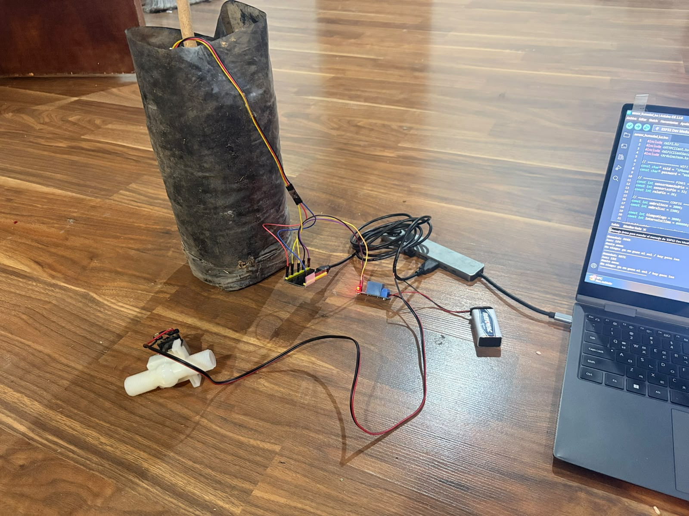
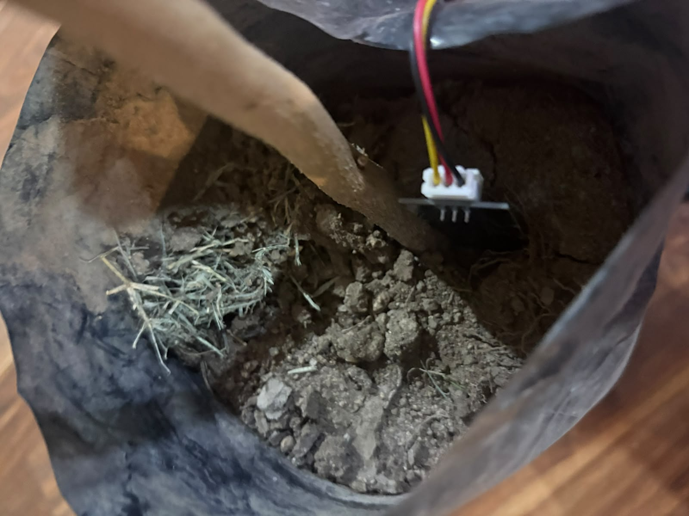
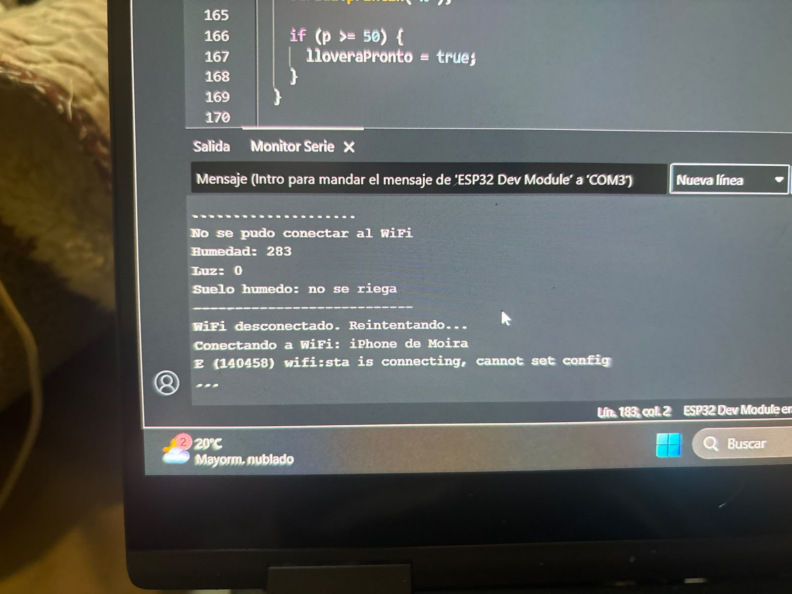
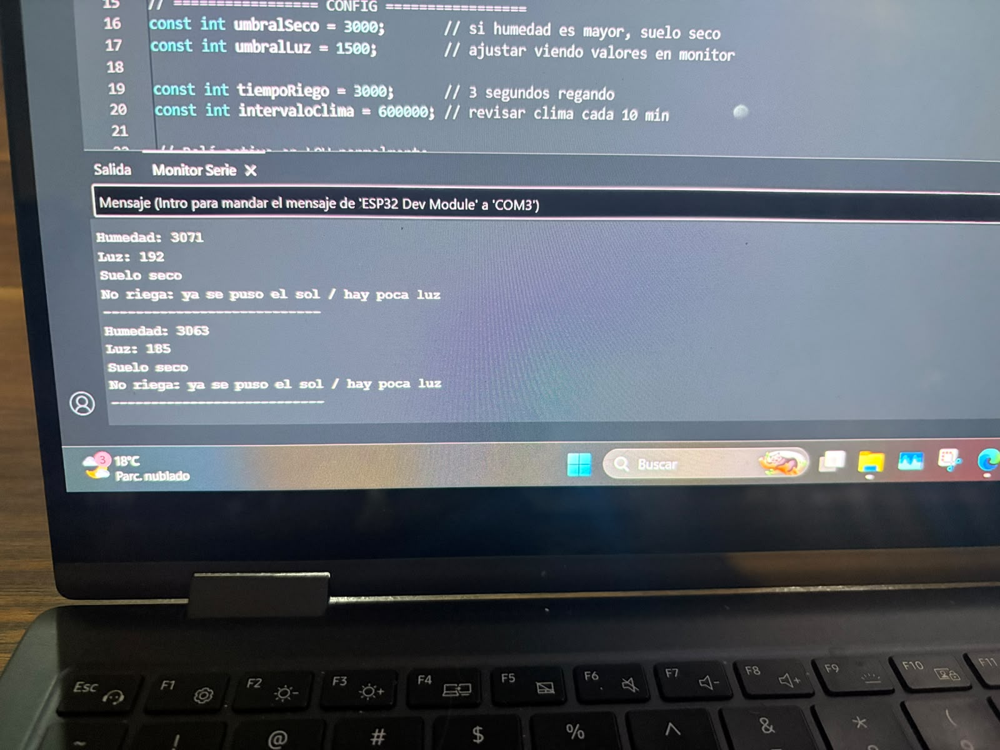
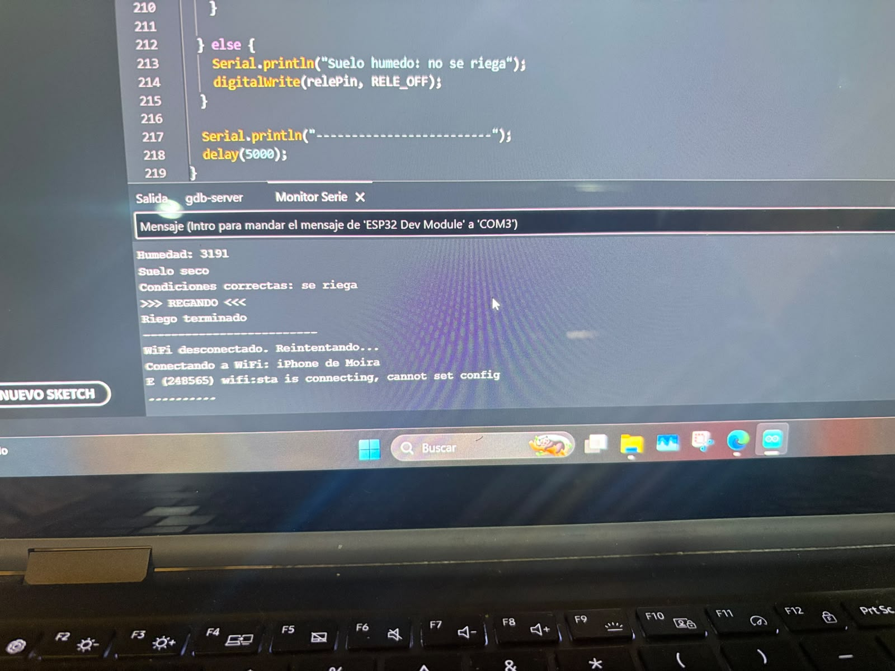

# Pruebas y validación del sistema

Esta carpeta contiene evidencias y resultados de las pruebas realizadas al sistema inteligente de monitoreo de humedad y recomendación de riego.

## Evidencias disponibles

### 1. Montaje general del sistema

Archivo: `montaje_general.jpg`

Esta imagen muestra el montaje completo del prototipo, incluyendo:

- bolsa con tierra,
- sensor de humedad,
- relé,
- electroválvula (fue eliminada del proyecto),
- cableado,
- conexión al computador.

### 2. Sensor de humedad en la tierra

Archivo: `sensor_en_tierra.jpg`

Esta imagen muestra la instalación física del sensor dentro de la tierra utilizada para las pruebas.

## Pruebas realizadas

### 1. Detección de suelo húmedo

Archivo: `prueba_suelo_humedo.jpg`

**Resultado observado:**

- Humedad medida: 283
- El sistema indica: `Suelo humedo: no se riega`

**Conclusión:**

El sistema detectó correctamente una condición de suelo húmedo y decidió no activar el riego.

### 2. Detección de suelo seco sin activación de riego por baja luz

Archivo: `prueba_suelo_seco_sin_riego.jpg`

**Resultado observado:**

- Humedad medida: 3071
- Luz medida: 192
- El sistema indica: `Suelo seco`
- El sistema indica: `No riega: ya se puso el sol / hay poca luz`

**Conclusión:**

El sistema detectó correctamente el suelo seco, pero no activó el riego porque la condición de luz no era adecuada.

### 3. Activación del riego

Archivo: `prueba_riego_exitoso.jpg`

**Resultado observado:**

- Humedad medida: 3191
- El sistema indica: `Suelo seco`
- El sistema indica: `Condiciones correctas: se riega`
- Luego muestra: `>>> REGANDO <<<`
- Finalmente: `Riego terminado`

**Conclusión:**

El sistema detectó correctamente una condición de suelo seco y activó el riego cuando se cumplieron las condiciones necesarias.

## Resumen de validación

Las pruebas realizadas permitieron comprobar que el sistema:

- detecta diferencias entre suelo húmedo y suelo seco,
- evalúa condiciones adicionales antes de regar,
- activa el riego cuando corresponde,
- registra mensajes de control mediante el monitor serial.

## Observaciones

Durante algunas pruebas se presentaron mensajes relacionados con la conexión WiFi, por ejemplo:

- `No se pudo conectar al WiFi`
- `WiFi desconectado. Reintentando...`
- 
  Esto indica que la conectividad WiFi aún requería ajustes durante el desarrollo, pero no impidió validar la lógica principal del sistema de riego.

## Galería de evidencias

### Montaje general

### Sensor en la tierra

### Prueba de suelo húmedo

### Prueba de suelo seco sin riego

### Prueba de riego exitoso

